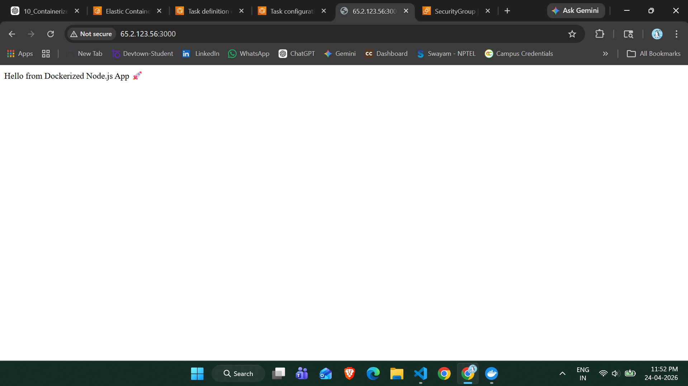

# 🚀 Containerized Node.js Application using Docker, ECR & ECS

## 📌 Project Overview

This project demonstrates how to containerize a Node.js application using Docker and deploy it on AWS using Amazon Elastic Container Registry (ECR) and Amazon Elastic Container Service (ECS - Fargate).

The application is built locally, containerized using Docker, pushed to AWS ECR, and deployed on ECS, making it publicly accessible via a public IP address.

---

## 🎯 Objectives

* Containerize a Node.js application using Docker
* Push Docker image to AWS Elastic Container Registry (ECR)
* Deploy container using AWS Elastic Container Service (ECS - Fargate)
* Make the application publicly accessible

---

## 🧰 Technologies Used

* Node.js
* Express.js
* Docker
* AWS ECR (Elastic Container Registry)
* AWS ECS (Elastic Container Service - Fargate)
---

## ⚙️ Step-by-Step Implementation

### 🔹 Step 1: Create Node.js Application

A simple Express.js server is created:

```javascript
const express = require('express');
const app = express();

app.get('/', (req, res) => {
  res.send('Hello from Dockerized Node.js App 🚀');
});

app.listen(3000, () => {
  console.log('Server running on port 3000');
});
```

---

### 🔹 Step 2: Create package.json

```json
{
  "name": "node-docker-app",
  "version": "1.0.0",
  "dependencies": {
    "express": "^4.18.2"
  }
}
```

---

### 🔹 Step 3: Create Dockerfile

```Dockerfile
FROM node:18

WORKDIR /app

COPY package*.json ./

RUN npm install

COPY . .

EXPOSE 3000

CMD ["node", "app.js"]
```

---

### 🔹 Step 4: Build Docker Image

```bash
docker build -t node-app .
```

---

### 🔹 Step 5: Run Container Locally

```bash
docker run -p 3000:3000 node-app
```

👉 Open in browser:

```
http://localhost:3000
```

---

### 🔹 Step 6: Push Image to AWS ECR

1. Create repository in AWS ECR
2. Login using AWS CLI:

```bash
aws ecr get-login-password --region ap-south-1 | docker login --username AWS --password-stdin <account-id>.dkr.ecr.ap-south-1.amazonaws.com
```

3. Tag Docker image:

```bash
docker tag node-app:latest <account-id>.dkr.ecr.ap-south-1.amazonaws.com/node-app:latest
```

4. Push Docker image:

```bash
docker push <account-id>.dkr.ecr.ap-south-1.amazonaws.com/node-app:latest
```

---

### 🔹 Step 7: Deploy on AWS ECS (Fargate)

1. Create ECS Cluster
2. Create Task Definition
3. Add container with ECR image
4. Configure:

   * Port: 3000
   * CPU: 256
   * Memory: 512
5. Create Service
6. Enable **Auto-assign Public IP**
7. Configure Security Group:

   * Allow port **3000**

---

## 🌐 Application Output



👉 Application URL:

```
http://<public-ip>:3000
```

---

## ✅ Result

* Successfully containerized Node.js application
* Docker image stored in AWS ECR
* Application deployed using AWS ECS (Fargate)
* Application is publicly accessible via internet

---

## 📌 Conclusion

This project demonstrates a complete DevOps workflow:

```
Node.js Application → Docker → AWS ECR → AWS ECS → Live Deployment
```

It showcases how modern cloud-native applications are built, containerized, and deployed efficiently using AWS services.

---
